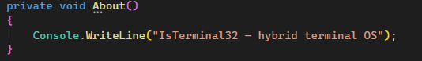

# Custom-Kernel
Contest the best Kernel for IsT

🇷🇺:Всем привет программисты! К чему я создал этот репозиторий К тому что я создаю гибрид ОС IsT "InsideSocietyTerminal" И я запускаю маленький конкурс Лучший kernel для IsT! Вы готовы испытать вашу фантазию?

🇪🇳:Hello, programmers! Why did I create this repository? Because I'm creating a hybrid OS called IsT "InsideSocietyTerminal" And I'm launching a small contest. The best kernel for IsT. Are you ready to test your imagination?

# Rules | Правила
**1. Кернел который вы написали на другом языке | The kernel that you wrote in another language**

🇷🇺: Пожалуйста! Не пишите кернел на другом языке только С# Иначе вы просто не попадёте в видео!

🇪🇳: Please! Don't write the kernel in a different language, only C#  Otherwise, you won't be able to watch the video!

**2. Ворованный Kernel | The stolen kernel**

🇷🇺: Вы считаетесь воришкой если украли у пользователя Kernel который он написал сам Всё равно вы не попадёте видео

🇪🇳: You are considered a thief if you stole a Kernel from a user that he wrote himself You will not get the video anyway

**3. Написание кода | Writing code**

🇷🇺: Если в вашем Кернел будут ошибки
"0x02_COMPILE_ERROR - вам будет выслано уведомление Вы не попадёте в видео! Но! Всё равно я вас отмечу!
0x03_ENTRY_POINT_NOT_FOUND - также будет выслано уведомление и всё равно вас отмечу

🇪🇳:If your Kernel has errors
"0x02_COMPILE_ERROR" - you will receive a notification You won't be featured in the video! But! I'll still tag you!
0x03_ENTRY_POINT_NOT_FOUND - you will also receive a notification, but I'll still tag you.

**WARNING⚠️**

**Пожалуйста оставьте в строчке about что это реально терминал IsT если будет MyTerminalOS или другое то вы не попадёте в видео!!**

**Please leave in the about line that this is actually a terminal IsT. If it is MyTerminalOS or something else, you will not be included in the video!!**

# Как мне написать куда и как заполнять | How should I write where and how should I fill it out?
**1. Куда отправлять код?**

🇷🇺:Всё зависит от вас можно в Telegram а также в комментарий TikTok

🇪🇳:It all depends on you. You can do it in Telegram or in the TikTok comments.

**2.Как заполнять?**

🇷🇺: В телеграмм
1.Название вашего Kernel

2.Файл Kernel(напрямую) или Яндекс Диск, Гугл диск или ссылка на Github(лучше ссылку на github)

3.Имя пользователя в Tiktok

В Tiktok
1. Название вашего Kernel

2. Ссылка на Яндекс Диск, Гугл диск, github как вам удобно

🇪🇳: In Telegram
1. Your Kernel name

2. Kernel file (directly) or Yandex Disk, Google Drive, or Github link (preferably a Github link)

3. TikTok username

In TikTok
1. Your Kernel name

2. Link to Yandex Disk, Google Drive, or GitHub, as per your preference

🇷🇺: Удачи вам!
----
🇪🇳:Good luck to you!
----

Source File:SystemKernel.cs  | Исходник SystemKernel.cs
-----
